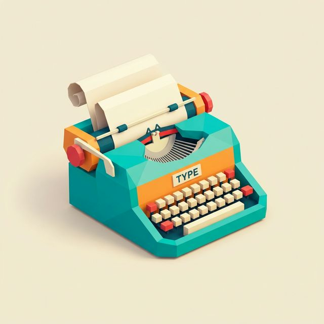

# etypwwriter launcher (Version 1.0)

  

Este es un launcher minimalista para Android con una estética inspirada en las máquinas de escribir, centrado en la tipografía y la simplicidad.

## Estado actual: Version 1.0
Se han completado todas las fases iniciales de desarrollo, proporcionando una experiencia funcional y elegante.

### Funcionalidades Implementadas:
- **Pantalla Principal (Home):**
    - Reloj minimalista de gran formato.
    - Lista de hasta 8 aplicaciones favoritas.
    - Acceso rápido a la edición de favoritos.
- **Cajón de Aplicaciones (App Drawer):**
    - Acceso mediante deslizamiento vertical (swipe up).
    - Listado alfabético de todas las aplicaciones instaladas.
    - **Búsqueda Dinámica:** Filtrado en tiempo real mientras escribes.
    - **Doble Columna:** Soporte nativo para tablets y dispositivos plegables (foldables).
- **Personalización y Organización:**
    - **Renombrar Apps:** Posibilidad de asignar nombres personalizados a cualquier aplicación.
    - **Carpetas:** Creación y gestión de carpetas en el cajón de aplicaciones.
    - **Ocultar Apps:** Mantén tu cajón limpio ocultando las apps que no usas frecuentemente (accesibles bajo "Ver más...").
- **Sistema:**
    - Configuración como launcher por defecto integrada.
    - Detección automática de apps desinstaladas para liberar espacios en favoritos.

## Especificaciones Técnicas
- **Namespace:** `com.etypwwriter.launcher`
- **Minimum SDK:** 26 (Android 8.0)
- **Target SDK:** 35 (Android 15)
- **UI Framework:** Jetpack Compose (Material 3)
- **Lenguaje:** Kotlin

## Roadmap

Importante:
- Capacidad para desinstalar Apps desde la lista.
- Sacar de la lista principal las app en carpetas. Pero seguir permitiendo buscarlas con las demas apps.

Deseables:
- Resumen de notificaciones en la pantalla home.
- Cambiar el fondo por imagen custom.
- Letras mas cercanas a una máquina de escribir.

---
*Diseñado para quienes buscan reducir distracciones y apreciar la estética de lo simple.*
